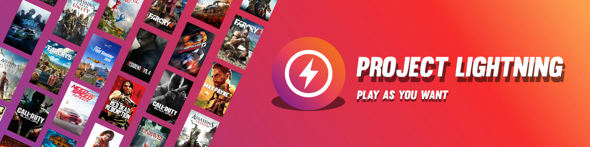

# ⚡ Project Lightning

  

## Table of Contents

- [Description](#description)
- [Features](#features)
- [System Requirements](#system-requirements)
- [Installation](#installation)
- [Usage](#usage)
- [Resources and Support](#resources-and-support)
- [License](#license)
- [Acknowledgments](#acknowledgments)

---

## Description

**Project Lightning** is an innovative application designed to deliver **solutions and enhancements to your games quickly and effortlessly**.  
With an intuitive interface and outstanding performance, Project Lightning fixes bugs, optimizes settings, and manages resources for your favorite titles.  
**Discover a new way to enjoy your games!**

---

## Features

- **Quick and Easy Installation:** A sleek, optimized installer to set up the application effortlessly on any PC.
- **Automatic Updates:** Stay up-to-date with background notifications and downloads.
- **Full Compatibility:** Optimized for Windows 10, Windows 11, and systems with .NET Framework 4.8.

---

## System Requirements

- **Operating System:** Windows 10, Windows 11 (Windows 7/8 may work if .NET Framework 4.8 is installed).
- **.NET Framework 4.8:** *If not installed, the installer will offer to download and install it automatically.*
- **Disk Space:** At least 200 MB of free space for installation and updates.
- **Internet Connection:** Required for updates and fixes downloads.

---

## Installation

### Option 1: Automatic Installation (Recommended)

1. **Download the installer** from the [official Project Lightning page](https://github.com/LightnigFast/Project-Lightning/releases).
2. Run the `ProjectLightningInstaller.exe` file.
3. Follow the setup wizard instructions to complete the installation.
4. A desktop shortcut will be created for quick access.

### Option 2: Manual Installation

- Download the installer from the [Project Lightning releases page](https://github.com/LightnigFast/Project-Lightning/releases).
- Ensure you have installed [.NET Framework 4.8](https://go.microsoft.com/fwlink/?linkid=2088631).
- Run the installer and follow the on-screen instructions.

---

## Usage

1. Launch **Project Lightning** via the desktop shortcut or from the Start Menu.
2. The main interface will load, displaying available fixes and update options.
3. Select the game you want to modify or update.
4. Follow the on-screen instructions to apply the fixes.
5. After completion, a confirmation message will appear letting you know your game is ready to play.

> **Note:** If you encounter any issues, please refer to the [Resources and Support](#resources-and-support) section.

---

## Resources and Support

- **Help Channel:** Join our [Discord/Slack/Telegram](https://discord.com/invite/NhqjTUWSWc) for real-time support.
- **Report Issues:** If you find a bug or want to suggest improvements, please open an [issue](https://github.com/LightnigFast/Project-Lightning/issues) on GitHub.

---

## License

> **Copyright © 2025 LightningFast**  
> **All rights reserved.**  
> 
> This source code and all associated files are the exclusive property of the author. No part of this project may be reproduced, distributed, or transmitted in any form or by any means, including copying, modifying, reusing, or publishing any part of the code or associated assets, without the prior written permission of the author.
> 
> Unauthorized use, distribution, or modification of this software or any of its components is **strictly prohibited** and may result in **legal action**.
> 
> This project is **not open-source** and does not grant any license for reuse or redistribution under any circumstances.

---

## Acknowledgments

- Thanks to [Flaticon](https://www.flaticon.com) and [Icons8](https://icons8.com) for providing amazing graphic resources.
- Thanks to the **GitHub** and **Stack Overflow** communities for the continuous support during development.
- And of course, thanks to **you** for using Project Lightning!

---

*Download, install, and supercharge your gaming experience with Project Lightning!* 🚀⚡
